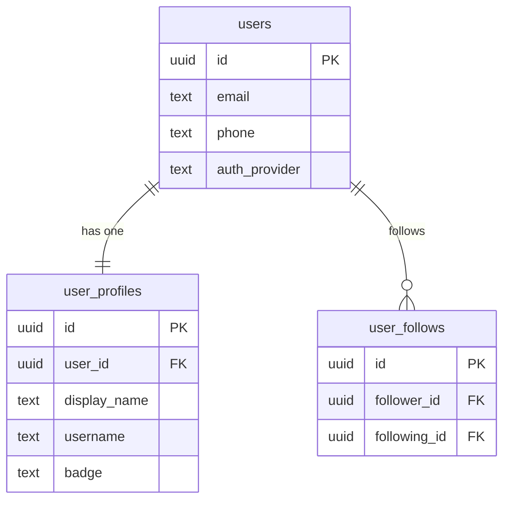
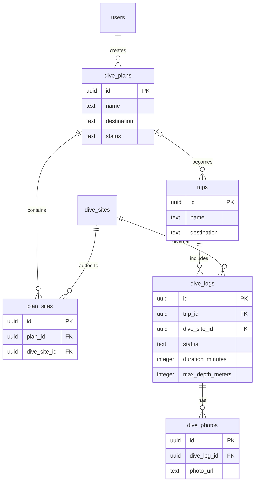
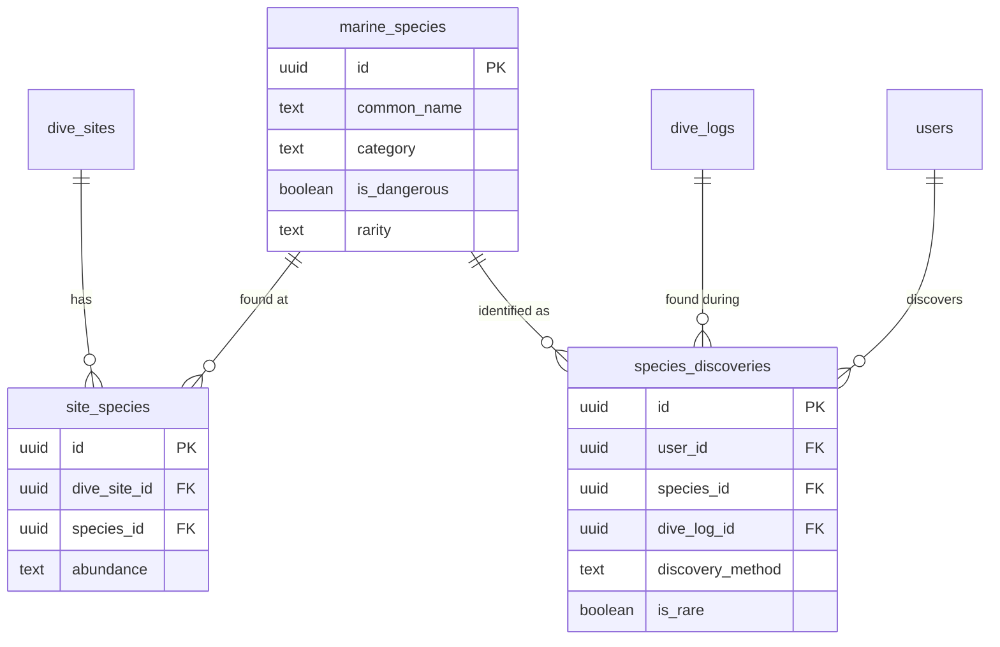
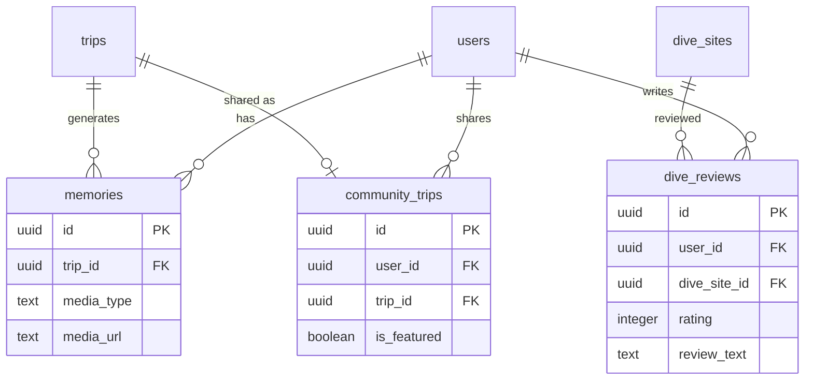
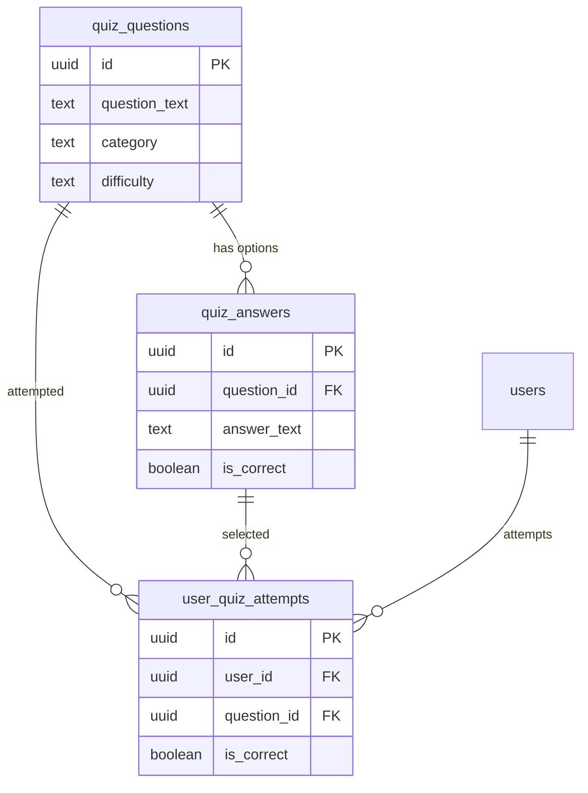

# Seafolio - Entity Relationship Diagram (ERD)

## Full ERD Diagram

```mermaid
erDiagram

    %% ============================================
    %% AUTHENTICATION & USER
    %% ============================================

    users {
        uuid id PK
        text email
        text phone
        text encrypted_password
        text auth_provider "email | phone | google | apple | facebook"
        timestamptz created_at
        timestamptz last_sign_in_at
    }

    user_profiles {
        uuid id PK
        uuid user_id FK "UNIQUE -> users.id"
        text display_name
        text username "UNIQUE @handle"
        text avatar_url
        text cover_photo_url
        text bio
        text badge "hobby_diver | advanced_diver | pro_diver | freediver | snorkeler"
        timestamptz created_at
        timestamptz updated_at
    }

    user_follows {
        uuid id PK
        uuid follower_id FK "-> users.id"
        uuid following_id FK "-> users.id"
        timestamptz created_at
    }

    %% ============================================
    %% DIVE SITES & MARINE SPECIES
    %% ============================================

    dive_sites {
        uuid id PK
        text name
        text description
        text country
        text region
        decimal latitude
        decimal longitude
        geography location "PostGIS POINT"
        text location_name "for text search"
        text difficulty "beginner | intermediate | advanced"
        text dive_type "shore | boat"
        integer min_depth
        integer max_depth
        text best_season
        text current_strength
        integer visibility_avg
        text image_url
        decimal avg_rating "calculated"
        integer review_count "calculated"
        timestamptz created_at
    }

    marine_species {
        uuid id PK
        text common_name
        text scientific_name
        text category "fish | mollusk | sea_reptile | echinoderm | crustacean | coral"
        text image_url
        text description
        boolean is_dangerous
        text rarity "common | uncommon | rare | very_rare"
        text conservation_status
        timestamptz created_at
    }

    site_species {
        uuid id PK
        uuid dive_site_id FK "-> dive_sites.id"
        uuid species_id FK "-> marine_species.id"
        text abundance "rare | occasional | common | abundant"
        text best_season
        timestamptz created_at
    }

    %% ============================================
    %% DIVE PLANS
    %% ============================================

    dive_plans {
        uuid id PK
        uuid user_id FK "-> users.id"
        text name
        text description
        text destination
        text status "draft | active | completed"
        timestamptz created_at
        timestamptz updated_at
    }

    plan_sites {
        uuid id PK
        uuid plan_id FK "-> dive_plans.id"
        uuid dive_site_id FK "-> dive_sites.id"
        integer sort_order
        timestamptz added_at
    }

    %% ============================================
    %% TRIPS & DIVE LOGS
    %% ============================================

    trips {
        uuid id PK
        uuid user_id FK "-> users.id"
        uuid plan_id FK "NULLABLE -> dive_plans.id"
        text name
        text destination
        text country
        text cover_image_url
        decimal avg_rating "calculated from dive reviews"
        integer site_count "calculated"
        integer dive_count "calculated"
        integer species_count "calculated"
        timestamptz start_date
        timestamptz end_date
        timestamptz created_at
    }

    dive_logs {
        uuid id PK
        uuid user_id FK "-> users.id"
        uuid trip_id FK "-> trips.id"
        uuid dive_site_id FK "-> dive_sites.id"
        text status "planned | active | completed"
        text dive_type "scuba_diving | snorkeling | freediving"
        text logging_method "device_sync | manual"
        text device_name "e.g. Garmin Descent G2"
        integer duration_minutes
        integer max_depth_meters
        decimal water_temp_celsius
        text visibility "poor | moderate | good | excellent"
        text description
        integer rating "0-5"
        timestamptz started_at
        timestamptz completed_at
        timestamptz created_at
    }

    dive_photos {
        uuid id PK
        uuid dive_log_id FK "-> dive_logs.id"
        uuid user_id FK "-> users.id"
        text photo_url
        text caption
        boolean is_cover
        integer sort_order
        timestamptz created_at
    }

    dive_reviews {
        uuid id PK
        uuid user_id FK "-> users.id"
        uuid dive_site_id FK "-> dive_sites.id"
        uuid dive_log_id FK "NULLABLE -> dive_logs.id"
        text review_text "max 1000 chars"
        integer rating "0-5"
        timestamptz created_at
        timestamptz updated_at
    }

    %% ============================================
    %% SPECIES DISCOVERIES
    %% ============================================

    species_discoveries {
        uuid id PK
        uuid user_id FK "-> users.id"
        uuid species_id FK "-> marine_species.id"
        uuid dive_log_id FK "NULLABLE -> dive_logs.id"
        uuid dive_site_id FK "-> dive_sites.id"
        text discovery_method "ai_identification | manual"
        boolean is_rare
        timestamptz discovered_at
    }

    %% ============================================
    %% MEMORIES & COMMUNITY
    %% ============================================

    memories {
        uuid id PK
        uuid user_id FK "-> users.id"
        uuid trip_id FK "-> trips.id"
        text title "e.g. Maldives trip"
        text subtitle "e.g. During this trip you went snorkeling"
        text media_type "photo | video | cinematic_reel"
        text media_url
        text thumbnail_url
        integer sort_order
        timestamptz created_at
    }

    community_trips {
        uuid id PK
        uuid user_id FK "-> users.id"
        uuid trip_id FK "-> trips.id"
        boolean is_featured "app team can feature on Home"
        text visibility "public | followers_only"
        timestamptz created_at
    }

    %% ============================================
    %% QUIZ / GAMIFICATION
    %% ============================================

    quiz_questions {
        uuid id PK
        text question_text
        text image_url
        text category "diving_history | marine_biology | safety | geography"
        text difficulty "easy | medium | hard"
        timestamptz created_at
    }

    quiz_answers {
        uuid id PK
        uuid question_id FK "-> quiz_questions.id"
        text answer_text
        boolean is_correct
        integer sort_order
        timestamptz created_at
    }

    user_quiz_attempts {
        uuid id PK
        uuid user_id FK "-> users.id"
        uuid question_id FK "-> quiz_questions.id"
        uuid selected_answer_id FK "-> quiz_answers.id"
        boolean is_correct
        timestamptz attempted_at
    }

    %% ============================================
    %% RELATIONSHIPS
    %% ============================================

    users ||--|| user_profiles : "has one"
    users ||--o{ user_follows : "follows"
    users ||--o{ dive_plans : "creates"
    users ||--o{ trips : "has"
    users ||--o{ dive_logs : "logs"
    users ||--o{ dive_photos : "uploads"
    users ||--o{ dive_reviews : "writes"
    users ||--o{ species_discoveries : "discovers"
    users ||--o{ memories : "has"
    users ||--o{ community_trips : "shares"
    users ||--o{ user_quiz_attempts : "attempts"

    dive_sites ||--o{ site_species : "has"
    marine_species ||--o{ site_species : "found at"
    dive_sites ||--o{ plan_sites : "added to"
    dive_sites ||--o{ dive_logs : "dived at"
    dive_sites ||--o{ dive_reviews : "reviewed"
    dive_sites ||--o{ species_discoveries : "discovered at"

    dive_plans ||--o{ plan_sites : "contains"
    dive_plans |o--o{ trips : "becomes"

    trips ||--o{ dive_logs : "includes"
    trips ||--o{ memories : "generates"
    trips ||--o| community_trips : "shared as"

    dive_logs ||--o{ dive_photos : "has"
    dive_logs ||--o{ species_discoveries : "found during"
    dive_logs |o--o| dive_reviews : "reviewed in"

    marine_species ||--o{ species_discoveries : "identified as"

    quiz_questions ||--o{ quiz_answers : "has options"
    quiz_questions ||--o{ user_quiz_attempts : "attempted"
    quiz_answers ||--o{ user_quiz_attempts : "selected"
```

---

## Diagram by Domain

### Domain 1: User & Social

### Domain 2: Dive Planning & Execution

### Domain 3: Species Discovery

### Domain 4: Community & Content

### Domain 5: Quiz & Gamification

---

## Table Count Summary

| Domain | Tables | Description |
|--------|--------|-------------|
| User & Social | 3 | users, user_profiles, user_follows |
| Dive Sites & Species | 3 | dive_sites, marine_species, site_species |
| Dive Planning | 2 | dive_plans, plan_sites |
| Trips & Logging | 4 | trips, dive_logs, dive_photos, dive_reviews |
| Discovery | 1 | species_discoveries |
| Content & Community | 2 | memories, community_trips |
| Gamification | 3 | quiz_questions, quiz_answers, user_quiz_attempts |
| **Total** | **18** | |

---
